# 飞钉微用户使用手册

本文面向第一次使用飞钉微的业务、产品、研发、测试和团队负责人，说明如何在一个 Agent 原生项目房间中完成讨论、生成草稿、人工评审、跨角色协作、创建新房间和追溯 Agent 运行记录。

截图基于本地 seed 数据和 faux provider 演示环境生成。真实部署中，用户、房间名称、任务内容和模型输出会以实际数据为准。

## 目录

1. [产品概念](#产品概念)
2. [登录与角色](#登录与角色)
3. [项目房间首页](#项目房间首页)
4. [在对话中协作](#在对话中协作)
5. [@Agent 生成任务和文档草稿](#agent-生成任务和文档草稿)
6. [任务草稿的编辑、指派、评审和批准](#任务草稿的编辑指派评审和批准)
7. [文档草稿的编辑、负责人、评审和批准](#文档草稿的编辑负责人评审和批准)
8. [决策日志](#决策日志)
9. [Agents 页与运行追溯](#agents-页与运行追溯)
10. [收件箱与跨用户通知](#收件箱与跨用户通知)
11. [成员目录](#成员目录)
12. [创建新项目房间](#创建新项目房间)
13. [导出房间数据](#导出房间数据)
14. [常见问题](#常见问题)

## 产品概念

飞钉微当前版本的核心工作空间是 **项目房间**。一个房间同时承载：

- 团队对话：人和 Agent 都在同一个上下文里协作。
- 任务：Agent 生成或人维护的任务草稿，需要人工批准后才生效。
- 文档：例如 PRD 草稿、评审说明、项目总结。
- 决策：沉淀团队已经确认的方向和边界。
- Agents：查看可用智能体、运行历史、输入输出和生成产物。
- 成员与权限：不同房间可以选择不同成员和角色。

当前版本不是完整 OA、CRM、IM 或企业组织管理系统。它聚焦在项目房间内的人机协作闭环。

## 登录与角色

本地演示环境提供这些 seed 用户：

| 用户 | 邮箱 | 常见职责 |
|---|---|---|
| Founder | `founder@feidingwei.local` | 工作区 owner / 管理者 |
| Business | `business@feidingwei.local` | 业务输入、客户反馈、创建房间 |
| Product | `product@feidingwei.local` | 需求整理、PRD、任务负责人 |
| Engineer | `engineer@feidingwei.local` | 研发评审、退回修改 |
| QA | `qa@feidingwei.local` | 测试评审、ReviewAgent 触发 |

使用步骤：

1. 打开本地应用地址，例如 `http://127.0.0.1:3100`。
2. 在登录页选择一个演示用户。
3. 点击 `进入飞钉微`。

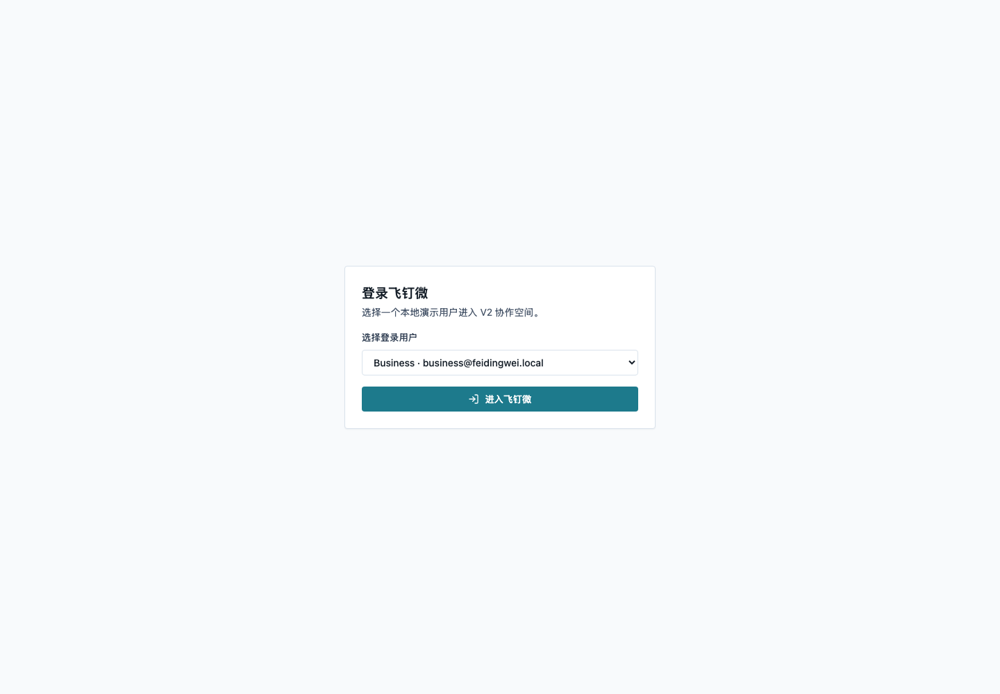

## 项目房间首页

登录后会进入可访问的项目房间。页面主要区域如下：

- 左侧：工作区、可访问项目房间、收件箱、成员、新建项目房间。
- 顶部：当前房间名称、描述、当前登录用户、设置。
- 中部标签：对话、任务、文档、决策、智能体。
- 底部输入框：发送普通消息、`@成员` 消息或 `@Agent` 消息。

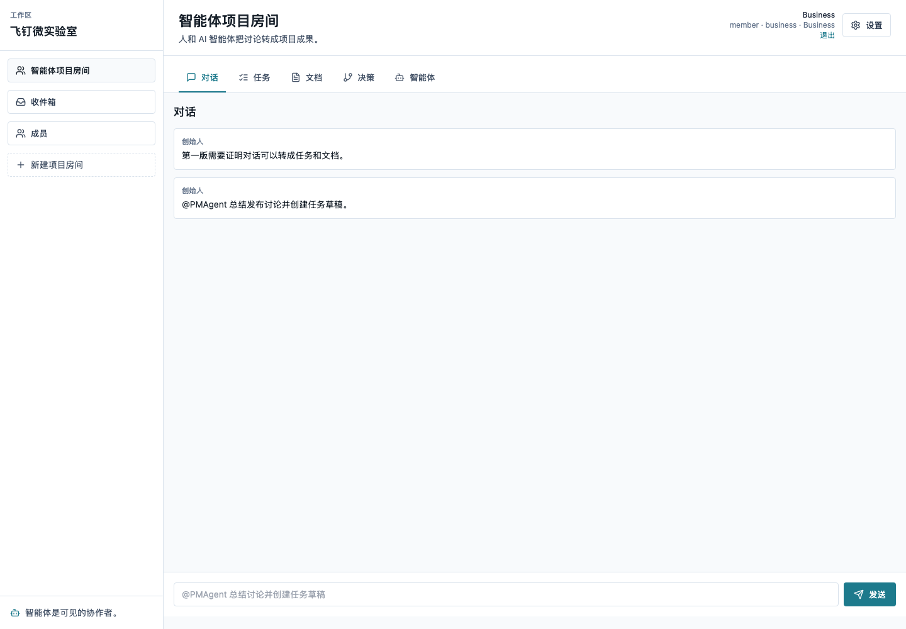

## 在对话中协作

普通对话用于沉淀项目上下文。你可以：

- 直接输入项目进展、客户反馈、问题或风险。
- 使用 `@product`、`@engineer`、`@qa` 等成员 mention 触发对方收件箱通知。
- 使用 `@PMAgent`、`@DocAgent`、`@ReviewAgent` 触发智能体协作。

使用建议：

1. 业务先输入客户原话、背景、约束。
2. 产品补充需求目标和验收标准。
3. 研发补充技术边界和风险。
4. 测试补充验证路径。
5. 在上下文足够明确后，再让 Agent 生成结构化草稿。

注意：人类 `@成员` mention 只会发送普通消息并创建通知，不会触发 Agent 生成计划。

## @Agent 生成任务和文档草稿

飞钉微当前提供默认可见 Agent：

| Agent | 触发方式 | 适合场景 |
|---|---|---|
| 产品智能体 | `@PMAgent` | 总结讨论、创建任务草稿、生成 PRD 草稿 |
| 文档智能体 | `@DocAgent` | 生成结构化文档草稿 |
| 评审智能体 | `@ReviewAgent` | 检查风险、遗漏项、阻塞点 |

生成步骤：

1. 在对话输入框输入类似：`@PMAgent 基于客户反馈生成协作任务和 PRD 草稿`。
2. 点击 `发送`。
3. 系统显示 `生成计划`，列出将创建的草稿类型。
4. 人工确认无误后点击 `确认生成`。
5. Agent 执行后，会在房间中生成任务草稿和文档草稿。

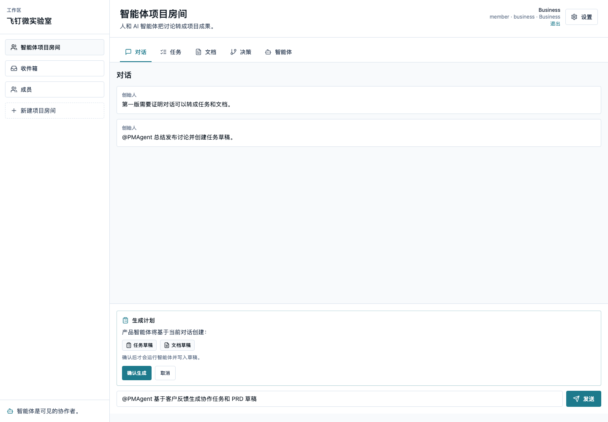

设计原则：

- Agent 不直接创建生效任务或生效文档。
- Agent 产物默认是草稿。
- 草稿需要人类编辑、指派、评审、批准或拒绝。
- 所有生成产物都会保留来源消息和 Agent run 追溯信息。

## 任务草稿的编辑、指派、评审和批准

进入 `任务` 标签后，可以看到 seed 任务和 Agent 生成的任务草稿。

每个任务卡片通常包含：

- 标题和描述。
- 状态、优先级、草稿/生效/拒绝状态。
- 负责人、评审人、评审状态。
- 来源消息和 Agent run。
- 操作按钮：`批准`、`编辑`、`拒绝`。
- 指派负责人、请求评审、退回修改输入框。

常见流程：

1. 产品或房间负责人打开 `任务`。
2. 检查 Agent 生成的任务是否准确。
3. 点击 `编辑` 修正标题、描述或优先级。
4. 在 `负责人` 下拉框中选择业务、产品、研发或测试成员，点击 `指派`。
5. 在 `评审人` 下拉框中选择评审人，点击 `请求评审`。
6. 被请求评审的人在收件箱中收到通知，进入房间查看任务。
7. 评审人可以批准，也可以填写修改意见并点击 `退回修改`。
8. 任务确认无误后，由有权限的人点击 `批准`，草稿变为生效任务。

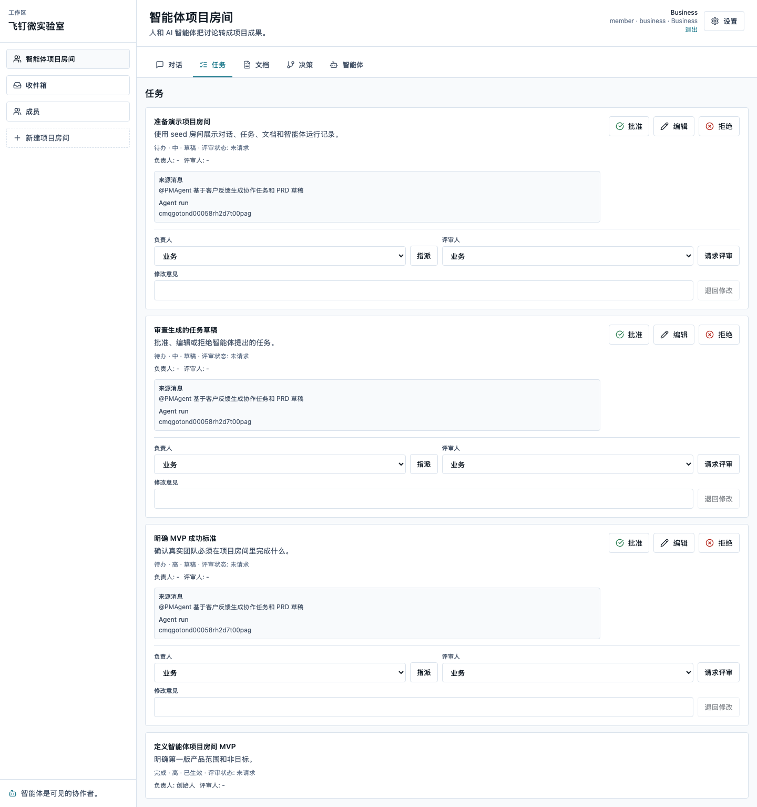

权限提示：

- `room_lead`、`reviewer` 可以批准或退回草稿。
- 若选择了特定评审人，普通批准通常需要由该评审人完成；房间负责人和工作区管理员可以覆盖。
- `viewer` 只能读取，不能编辑、批准或触发 Agent。

## 文档草稿的编辑、负责人、评审和批准

进入 `文档` 标签后，可以看到 PRD 草稿或其他文档草稿。

文档流程和任务类似：

1. 打开 `文档`。
2. 阅读 Agent 生成的 PRD 或文档内容。
3. 点击 `编辑` 修正文档标题和正文。
4. 设置 `负责人`，点击 `指派`。
5. 设置 `评审人`，点击 `请求评审`。
6. 评审人审阅后批准，或填写修改意见后退回。
7. 文档确认后点击 `批准`，草稿变为生效文档。

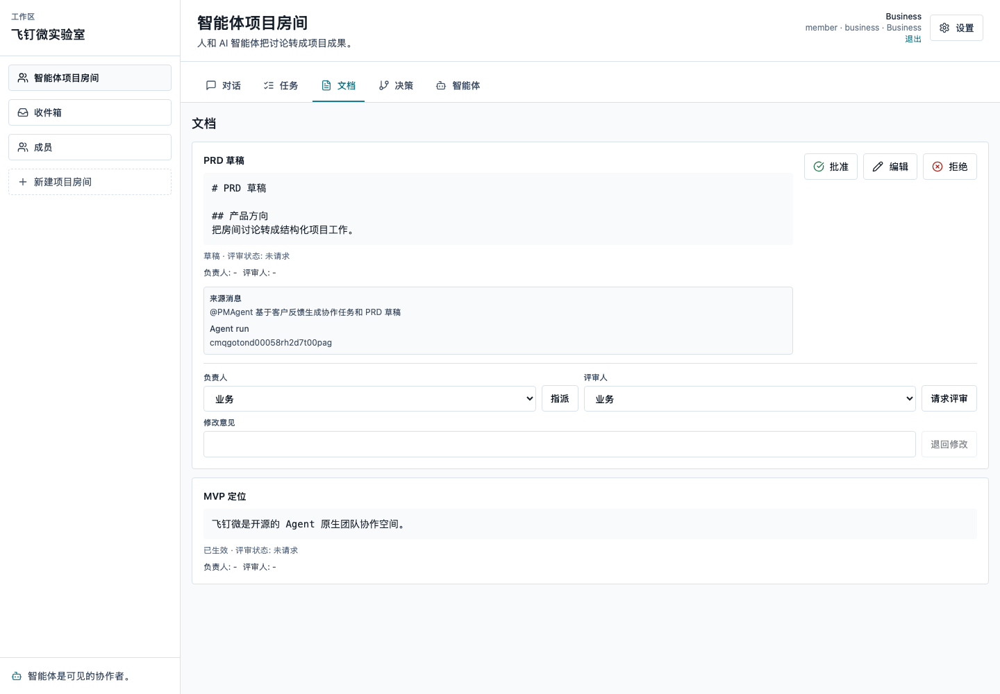

使用建议：

- 把 Agent 文档当作初稿，不要直接视为最终版本。
- PRD、评审说明、项目总结都应保留清晰的来源和修改记录。
- 修改意见应写清楚阻塞原因，方便产品或业务继续补充。

## 决策日志

`决策` 标签用于记录团队已经确认的方向、边界和取舍。

记录步骤：

1. 打开 `决策` 标签。
2. 在 `决策标题` 输入一句可被检索的标题。
3. 在 `决策内容` 写清楚背景、结论和约束。
4. 点击 `记录决策`。

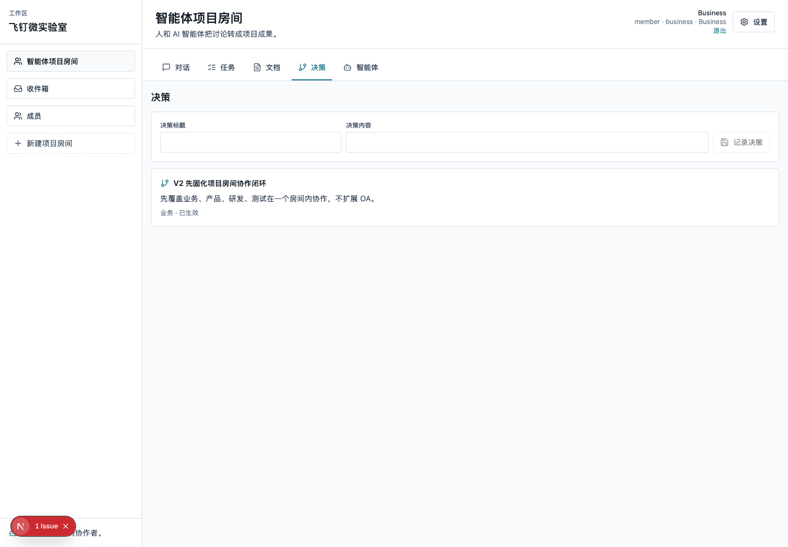

适合记录的内容：

- V2 是否优先做项目房间，而不是扩展 OA。
- 某个需求是否进入当前迭代。
- 研发评审后的技术方案选择。
- 测试验收边界。
- Agent 产物是否采用、修改或拒绝的原因。

Agent 也可以生成决策草稿，但 Agent 生成的决策仍应经过人工确认。

## Agents 页与运行追溯

`智能体` 标签用于查看当前房间的可用 Agent 和运行记录。

你可以看到：

- 当前 provider/model 模式。
- Agent 名称和 mention token。
- 每次 Agent run 的状态、输入、输出。
- 触发消息。
- 生成的任务、文档、决策。
- 生成产物的状态、负责人/评审人、评审状态。

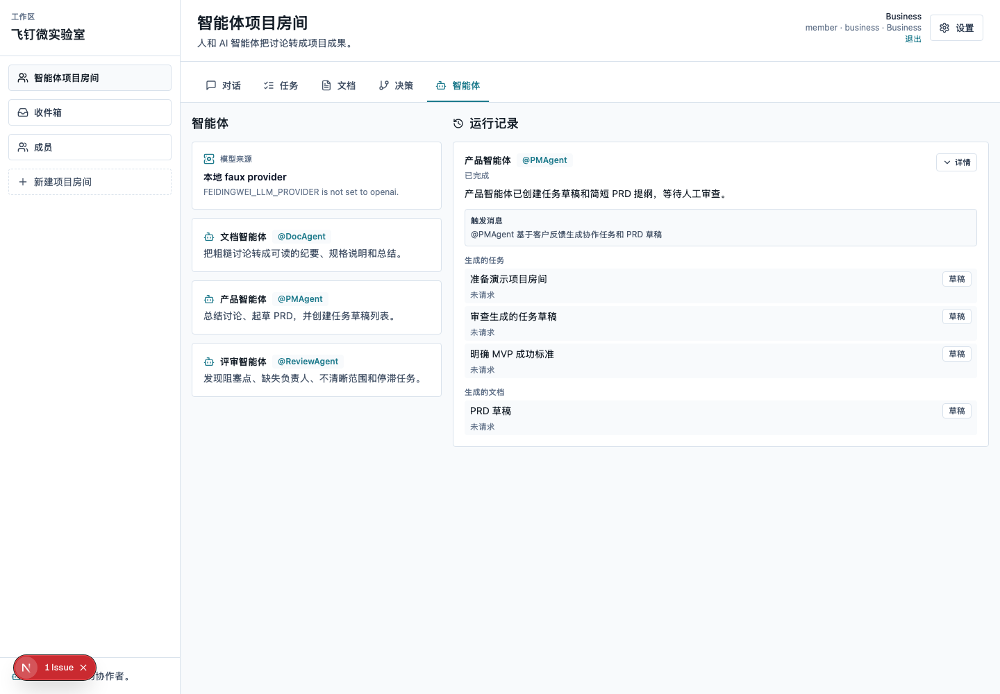

排查问题时，优先查看这里：

1. Agent 是否真的被触发。
2. 触发输入是什么。
3. Agent 输出了什么。
4. 生成了哪些任务、文档或决策。
5. 产物是否还处于草稿、已批准或已拒绝。

## 收件箱与跨用户通知

`收件箱` 是个人通知中心。以下动作会产生通知：

- 房间对话中 `@product`、`@engineer` 等人类 mention。
- 任务指派给某个成员。
- 文档指派给某个 owner。
- 请求某个成员评审任务或文档。
- 草稿被退回修改时通知相关负责人。

使用步骤：

1. 切换到被 mention 或被指派的用户。
2. 点击左侧 `收件箱`。
3. 在 `未读` 中查看通知。
4. 点击通知里的房间链接回到上下文。
5. 处理后可以点击 `标为已读`。

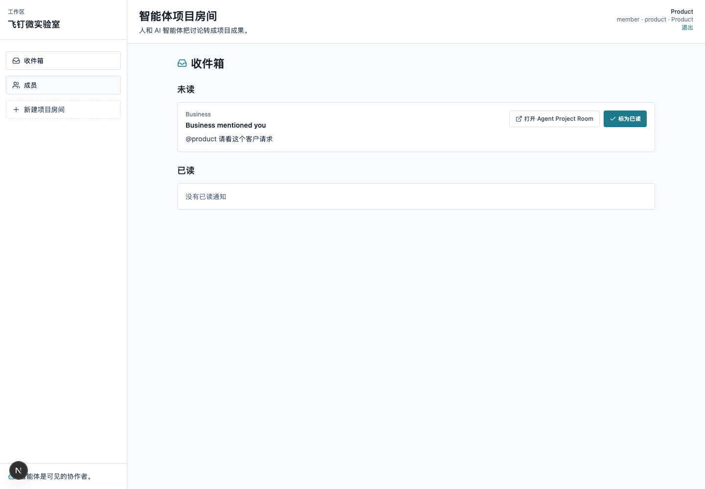

注意：通知只能由接收人标为已读，其他用户不能替别人处理通知状态。

## 成员目录

`成员` 页面提供轻量组织上下文，不是完整企业组织管理。

你可以查看：

- 成员姓名和邮箱。
- 工作区角色。
- 职能标签。
- 所属团队。
- 活跃房间和房间角色。

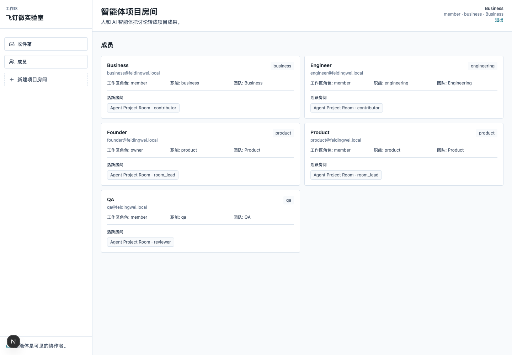

使用场景：

- 指派任务前确认成员职责。
- 请求评审前确认对方是否在当前房间。
- 了解业务、产品、研发、测试分别在哪些房间参与协作。

当前版本不支持在这里邀请用户、编辑组织架构或修改企业角色。

## 创建新项目房间

项目房间是协作边界。创建新房间适合这些场景：

- 一个新客户访谈需要独立沉淀。
- 一个产品需求需要业务、产品、研发、测试独立协作。
- 一个评审议题需要限制参与人。
- 一个项目阶段需要独立追踪 Agent 产物。

创建步骤：

1. 在左侧点击 `新建项目房间`。
2. 输入 `房间名称`。
3. 输入 `房间描述`。
4. 在 `选择成员` 中勾选已有工作区成员。
5. 为每个成员选择房间角色：
   - `负责人`：房间主责，能批准和管理房间工作。
   - `协作者`：可参与对话、任务、文档和 Agent 协作。
   - `评审人`：适合 QA、研发评审、ReviewAgent 协作。
   - `只读`：只能查看，不能修改。
6. 点击 `创建房间`。

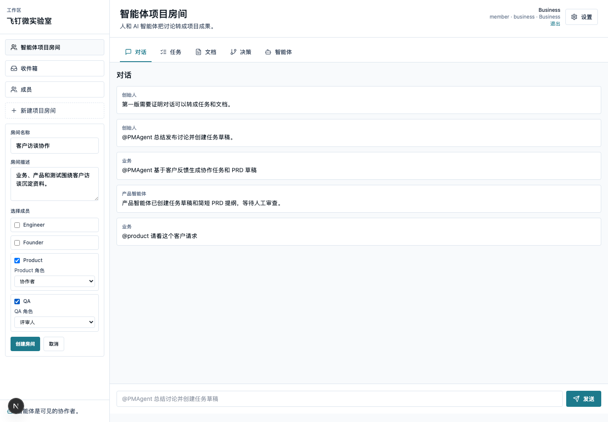

创建后会自动进入新房间。新房间会带上默认可见 Agent，可以立即开始对话、生成草稿、记录决策。

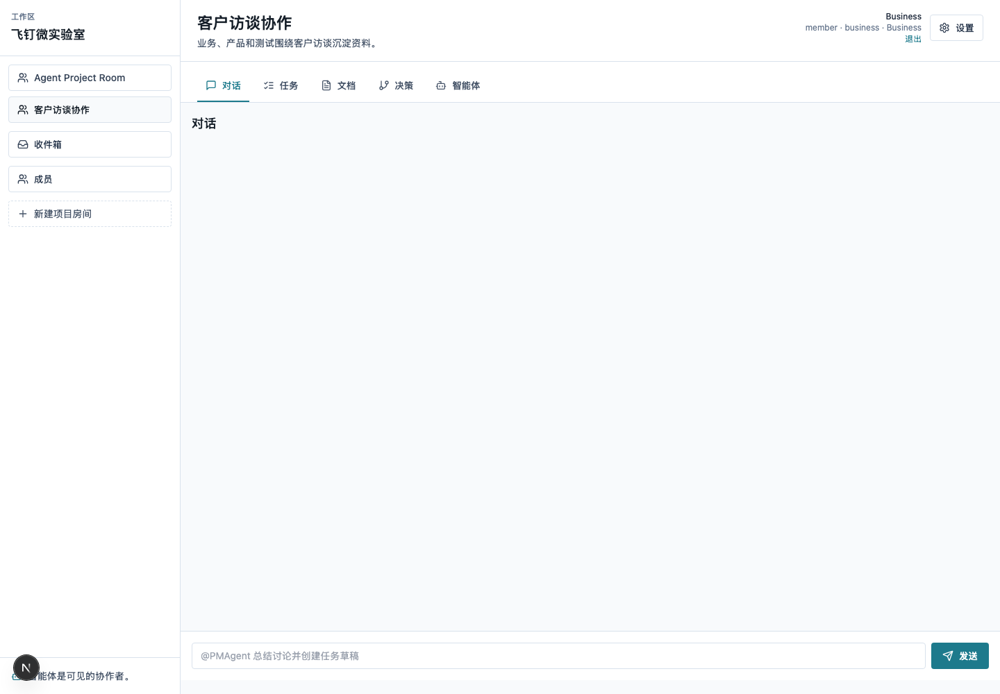

权限规则：

- 创建者自动成为 `room_lead`。
- 创建者不会出现在可勾选成员列表里。
- 未被选中的普通成员不会在左侧看到该房间。
- 未被选中的普通成员直接访问房间 URL 会被拦截。
- 当前版本不支持邀请外部用户，也不支持创建后编辑房间成员。

## 导出房间数据

房间右上角 `设置` 菜单提供导出功能。

导出步骤：

1. 打开目标房间。
2. 点击右上角 `设置`。
3. 点击 `导出房间数据`。
4. 浏览器会下载当前房间的 JSON 文件。

导出内容包括：

- 房间基本信息。
- 对话消息。
- 任务和文档。
- 决策。
- Agents 和 Agent runs。
- 当前无密钥 provider/model 状态。

导出不包含 `.env`、API key 或本地数据库文件。它适合用于本地备份、调试和开源 issue 复现。

## 常见问题

### 为什么 Agent 生成后不是直接生效？

飞钉微的原则是 Agent 负责生成草稿，人负责判断和责任。任务、文档、决策都需要人类审阅后才能成为正式成果。

### `@product` 和 `@PMAgent` 有什么区别？

- `@product` 是人类 mention，会创建通知，不会触发 Agent。
- `@PMAgent` 是 Agent mention，会先显示生成计划，确认后才执行。

### 为什么我看不到某个房间？

通常是因为你不是该房间成员，也不是 workspace owner/admin。房间列表只展示你有权限读取的房间。

### 为什么直接打开房间 URL 是 404？

这是访问控制的当前表现。为了避免泄露房间是否存在，未授权访问会显示 404。

### 为什么本地截图中的 Agent 输出很固定？

截图使用 faux provider 生成，目的是让本地演示和自动化验证稳定。真实模型 provider 可以通过 `.env` 配置，但输出会更不确定。

### 当前版本能做企业 SSO、OA 审批或 CRM 吗？

不能。当前版本聚焦 Agent 项目房间协作，不包含企业 SSO、OA、CRM、考勤、报销、企业微信/钉钉/飞书集成或完整 IM 替代能力。

## 快速验收清单

- [ ] 可以选择用户登录。
- [ ] 可以在项目房间发送普通消息。
- [ ] `@product` 这类人类 mention 会进入对方收件箱。
- [ ] `@PMAgent` 会先显示生成计划。
- [ ] 确认生成后会出现任务草稿和文档草稿。
- [ ] 任务和文档可以编辑、指派、请求评审、批准、拒绝或退回修改。
- [ ] 决策可以被记录并显示在决策日志中。
- [ ] Agents 页能看到触发消息、输入、输出和生成产物。
- [ ] 成员目录能看到成员角色、职能、团队和活跃房间。
- [ ] 可以创建新房间并选择成员角色。
- [ ] 未加入房间的普通成员看不到新房间。
- [ ] 设置菜单可以导出房间 JSON 数据。
